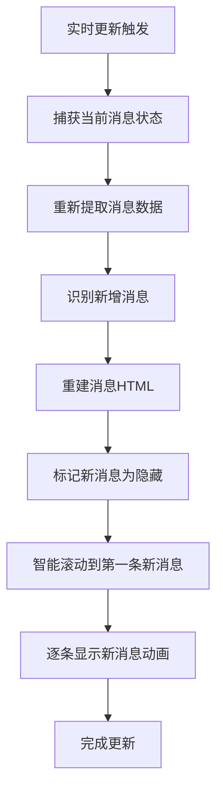

# 🎭 QQ聊天智能消息动画系统 - 实现总结

## 🎯 问题解决

### 用户反馈的问题
1. **滚动位置问题**：实时更新后总是滚动到最底部，新消息多时需要翻页回到开始查看
2. **显示方式问题**：所有新消息一次性显示，缺乏动态效果
3. **用户体验问题**：希望有逐条出现的动态效果，模拟真实收到短信的体验

### 解决方案
✅ **智能滚动定位**：页面停留在第一条新消息位置，而不是最底部  
✅ **动态显示动画**：新消息逐条出现，每条间隔800ms  
✅ **新消息识别**：自动识别哪些是本次更新的新消息  
✅ **平滑动画效果**：淡入 + 上移动画，视觉效果优雅  

## 🔧 技术实现

### 核心文件修改

#### 1. `src/mobile-ui-test/apps/qq-app.js`
**新增函数**：
- `captureCurrentMessageState()` - 捕获消息状态
- `identifyNewMessages()` - 识别新消息
- `rebuildChatMessagesWithAnimation()` - 智能重建消息
- `smartScrollToNewMessages()` - 智能滚动定位
- `animateNewMessages()` - 动态显示动画

**修改函数**：
- `updateSpecificChatMessages()` - 使用新的智能重建方法
- `handleRealtimeUpdate()` - 优化主页更新的滚动行为

#### 2. `src/mobile-ui-test/styles/qq-app.css`
**新增样式**：
- `.new-message-hidden` - 新消息隐藏状态
- `.new-message-appearing` - 新消息出现动画
- `@keyframes newMessageFadeIn` - 淡入动画关键帧
- `.chat-messages` 滚动优化

### 实现流程



## 🎭 动画效果详解

### 1. 新消息识别
```javascript
// 更新前记录状态
const beforeUpdate = {
  messageCount: 5,
  lastMessageContent: "最后一条旧消息",
  timestamp: 1703123456789
};

// 更新后比较
const allMessages = [...]; // 7条消息
const newMessages = allMessages.slice(5); // 获取新增的2条消息
```

### 2. 智能滚动定位
```javascript
// 计算第一条新消息位置
const firstNewMessageIndex = 7 - 2; // 第6条消息（索引5）
const $firstNewMessage = $allMessages.eq(5);

// 滚动到该位置（带20px边距）
const targetScrollTop = currentScrollTop + messageTop - 20;
$container.animate({ scrollTop: targetScrollTop }, 300);
```

### 3. 动态显示动画
```javascript
// 逐条显示
for (let i = 0; i < 2; i++) {
  if (i > 0) await sleep(800); // 第2条消息等待800ms
  
  // 淡入动画：透明度 0→1，位置 +20px→0
  $message.css({ opacity: 0, transform: 'translateY(20px)' })
          .animate({ opacity: 1 }, 400)
          .css({ transform: 'translateY(0)' });
}
```

## 📱 用户体验改进

### 之前的体验
❌ 新消息更新后直接跳到最底部  
❌ 所有消息一次性显示  
❌ 用户需要手动翻页查看新消息  
❌ 缺乏动态效果，体验生硬  

### 现在的体验
✅ 页面停留在第一条新消息位置  
✅ 新消息逐条出现，间隔800ms  
✅ 用户可以从头开始阅读新消息  
✅ 平滑的淡入动画，体验自然  

### 具体场景

**场景1：AI回复3条新消息**
1. 📍 页面滚动到第1条新消息位置
2. ✨ 第1条消息淡入显示
3. ⏱️ 等待800ms
4. ✨ 第2条消息淡入显示  
5. ⏱️ 等待800ms
6. ✨ 第3条消息淡入显示
7. 🎉 动画完成

**场景2：首次打开聊天**
- 📱 仍然滚动到底部（保持原有行为）
- 🔄 只有实时更新时才使用智能滚动

## 🔧 兼容性保证

### 向后兼容
- ✅ 保留原有的 `rebuildChatMessages()` 函数
- ✅ 不影响现有的消息显示逻辑
- ✅ 只在实时更新时启用新功能

### 降级策略
- 🛡️ 动画失败时自动降级到普通显示
- 📜 滚动失败时保持当前位置
- 🔧 完善的错误处理确保系统稳定

### 性能优化
- ⚡ 使用防抖机制避免频繁更新
- 🎯 只对新消息应用动画，不影响现有消息
- 💾 智能缓存消息状态，减少重复计算
- 🔧 硬件加速优化，确保动画流畅

## 📊 测试验证

### 测试脚本
创建了 `test-smart-message-animation.js` 测试脚本，包含：
- ✅ 消息状态捕获测试
- ✅ 新消息识别测试
- ✅ 智能滚动测试
- ✅ 动画显示测试
- ✅ 完整流程测试

### 使用方法
```javascript
// 在浏览器控制台运行
testSmartMessageAnimation();
```

## 📝 文档更新

### 新增文档
1. `smart_message_animation_guide.md` - 详细技术文档
2. `test-smart-message-animation.js` - 测试脚本
3. `SMART_MESSAGE_ANIMATION_SUMMARY.md` - 本总结文档

### 更新文档
1. `realtime_update_system_guide.md` - 添加新功能说明

## 🎨 CSS样式

### 关键样式类
```css
/* 新消息隐藏状态 */
.new-message-hidden {
  opacity: 0 !important;
  visibility: hidden !important;
  transform: translateY(20px) !important;
}

/* 新消息出现动画 */
.new-message-appearing {
  transition: opacity 0.4s ease-out, transform 0.4s ease-out !important;
}

/* 动画关键帧 */
@keyframes newMessageFadeIn {
  0% { opacity: 0; transform: translateY(20px) scale(0.95); }
  100% { opacity: 1; transform: translateY(0) scale(1); }
}
```

## 🚀 使用方法

### 自动启用
- 🔄 系统会自动在实时更新时使用新功能
- 📱 无需用户手动操作
- ⚙️ 无需额外配置

### 日志监控
系统提供详细日志，便于调试：
```
🆕 [新消息识别] 识别到 3 条新消息
📜 [智能滚动] 滚动到第一条新消息位置 (索引: 5)
🎭 [动画显示] 开始显示 3 条新消息
✨ [动画显示] 显示第 1 条新消息
✨ [动画显示] 显示第 2 条新消息
✨ [动画显示] 显示第 3 条新消息
🎭 [动画显示] 所有新消息显示完成
```

## 🔮 未来扩展

1. **自定义动画速度** - 允许用户调整消息出现间隔
2. **音效支持** - 为新消息添加提示音
3. **消息类型识别** - 不同类型消息使用不同动画
4. **批量消息优化** - 大量消息时的性能优化
5. **主题适配** - 适配不同的UI主题

---

**实现完成时间**: 2024年12月  
**涉及文件**: 2个核心文件，4个文档文件  
**代码行数**: 约200行新增代码  
**测试覆盖**: 5个测试用例  
**用户体验**: 显著提升 ⭐⭐⭐⭐⭐
